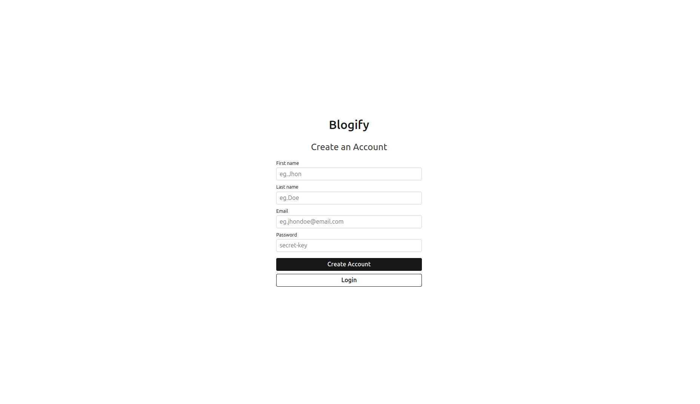
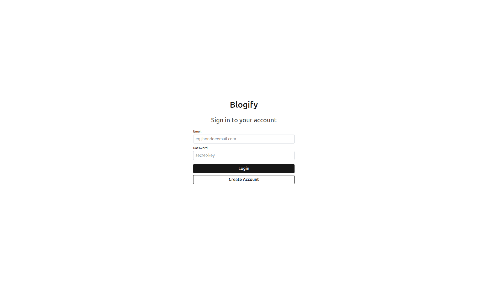
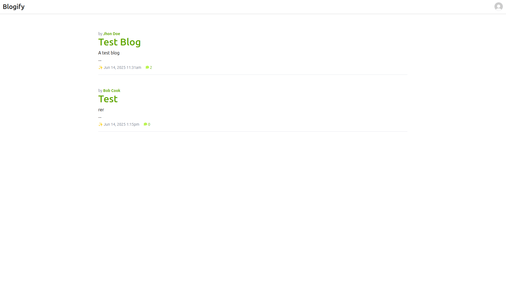
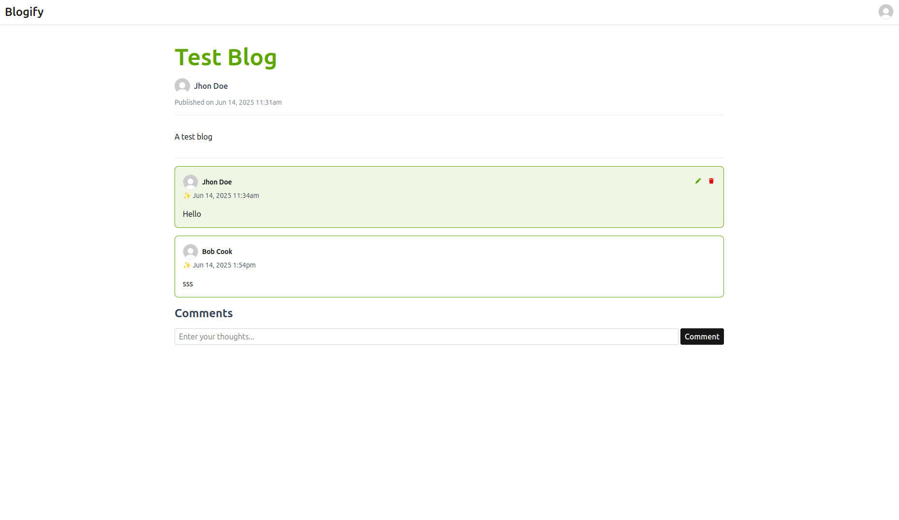
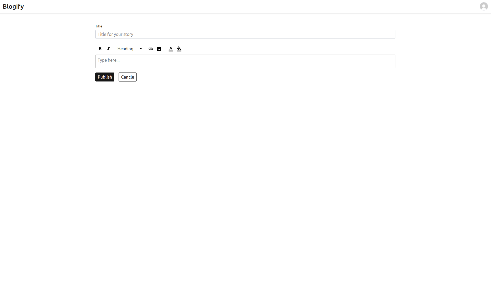

# Blogify

Blogify is a simple, full-stack blog application designed to allow users to create accounts, publish their own blogs, and interact with other users' through comments. The application leverages  Spring Boot for the backend, and Angular for the frontend.

## Features

  - **User Authentication:**
    - **Account Creation:** Users can register new accounts.
    - **Email Verification:** Secure email verification process for new registrations.
    - **User Login: Registered** users can log in to access personalized features.

  - **Blog Management:**
    - **View Blogs:** Browse and read existing blog posts.
    - **Create Blogs:** Authenticated users can create and publish their own blog posts.

  - **Interaction:**
    - **Comment on Blogs:** Users can post comments on blog entries.

## Getting Started

Follow these steps to get your Blogify application up and running.

### Clone the Repository

First, clone the Blogify repository to your local machine:

```bash
git clone https://github.com/your-username/blogify.git

cd blogify
```

### Docker Setup (Database)

Navigate to the root directory of the cloned repository (where docker-compose.yml is located).

**Start the Docker containers:** This command will start the PostgreSQL database.
```bash
docker-compose up --build -d
```

### Frontend Setup (Angular with Bun)

The frontend is an Angular application that uses bun for dependency management.
```bash
# Navigate to the backend directory
cd blog-client
  
bun install

bun run start
```
This will compile the Angular application and serve it, typically on `http://localhost:4200`.

### Running the Backend
Ensure all the Enviroment Varaible set in `.env` file and PostgreSQL is running

```bash
# Navigate to the backend directory
cd blog-api

# Build the Spring Boot application:
./mvnw clean install

# Run Springboot application
./mvnw spring-boot:run
```
The api will start on `http://localhost:8080`.

## Configuration
The backend application uses environment variables for various configurations, including database connection and email settings.

Create a `.env` file in the `blog-api` directory based on the provided `.env.example` and set the following values.
```.env
DATABASE_URL=jdbc:postgresql://localhost:5432/blogify
DATABASE_USERNAME=postgres
DATABASE_PASSWORD=password
SMTP_HOST=localhost
SMTP_PORT=1025
SMTP_USERNAME=no-reply@blogify.com
SMTP_PASSWORD=password
SECRET_KEY=ea46e63ce5fb39b2ae3c171d80c959901750f3f21f30e2a92d1fed6ad647efb9
```

## API Endpoints (Overview)
The backend API documentation is available via Swagger UI at:`http://localhost:8080/docs`

## Result


---


---


---


---

